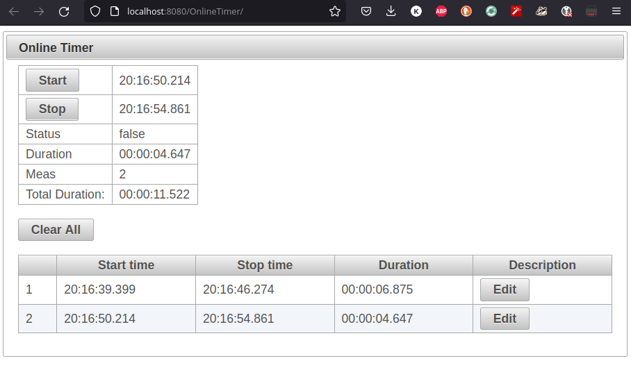
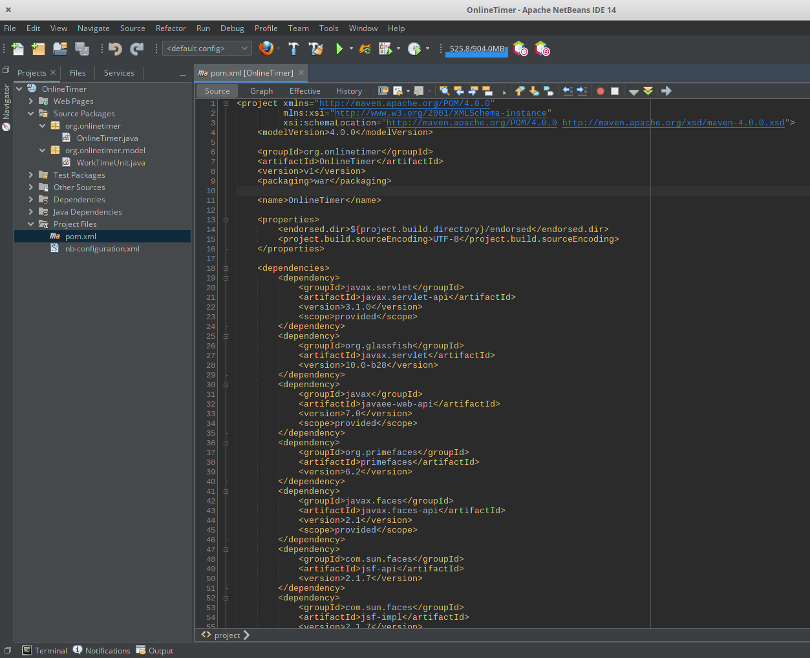

# Online Timer

<p align="center">
<a href="#about">About</a> •
<a href="#snapshot">Snapshot</a> •
<a href="#requirements">Requirements</a> •
<a href="#run">Run</a> •
<a href="#contribution">Contribution</a> •
</p>

---

## About

The aim of the project is to register time. 

It can be useful to measure work time or any other activity.

Time measurement can be stopped and resumed.

Measurements are shown in the list and the total time is calculated.

## Snapshot



## Requirements

* The project can be run either on [Glassfish 4.1](https://download.oracle.com/glassfish/4.1.1/release/index.html) or on [Wildfly 26.1.1](https://www.wildfly.org/downloads/)

* JDK

* Maven

## Run

Build:
```bash
PROJECT_HOME/mvn clean install
```
Start Glassfish:
```bash
GLASSFISH_HOME/bin/asadmin start-domain
```

Deploy
```bash
GLASSFISH_HOME/bin/asadmin deploy PROJECT_HOME/target/OnlineTimer-v1.war
```
Server logs:
```bash
tail -f GLASSFISH_HOME/glassfish/domains/domain1/logs/server.log
```

Verify deployment:
```bash
GLASSFISH_HOME/bin/asadmin list-applications
```
Visit 

<i> http://localhost:8080/OnlineTimer/ </i>

## Contribution

Feel free to use and modify the Online Timer

Further development is recommended in [Netbeans 14](https://netbeans.apache.org/) due to its support for [Primefaces 6.2](https://www.primefaces.org/)

